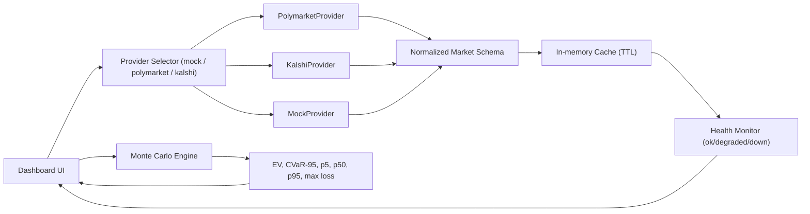

# EventRisk.ai

**Event Contracts, Risk Transfer, and the Derivatives Case for Prediction Markets**

[eventrisk.ai](https://eventrisk.ai) | [Full Paper (PDF)](https://eventrisk.ai/paper.pdf)

---

## Overview

EventRisk.ai is a research and simulation platform analyzing when event contracts can facilitate economically meaningful hedging under U.S. derivatives law. The project introduces the **Liquidity-Constrained Event Risk Transfer Curve (LCERTC)** — a framework for evaluating the structural capacity of prediction markets to absorb and redistribute tail risk.

The platform pairs a three-part academic paper series with interactive visualization tools and a full Monte Carlo simulation engine.

## Research Series

| Part | Title | Focus |
|------|-------|-------|
| **I** | *CFTC Jurisdiction and the Economic Purpose Test* | Swap definitions, limiting principles, and jurisdictional boundaries for event-based contracts |
| **II** | *Sportsbook Exposure and Risk Distribution* | How event markets evolve from wagering to risk transfer infrastructure |
| **III** | *Event Contracts and the Liquidity Threshold* | Introduces the LCERTC model — demonstrates that tail-risk compression, not EV improvement, is the economic purpose of event market hedging |

## Interactive Tools

### The Mechanism (`/explainer`)
Interactive parameter explorer with five linked charts. Adjust pool size, contract limits, event probability, and loss severity to see how the LCERTC curve responds in real time.

**Built with:** Chart.js

### The Analysis (`/paper`)
Reproduces every figure from Part III with preset scenario configurations. Toggle between baseline, stressed, and edge-case parameters to understand the model's behavior.

**Built with:** Plotly.js

### Stress Test (`/simulator`)
API-driven Monte Carlo simulator. Runs live simulations against configurable market conditions and visualizes distribution outcomes, hedge effectiveness, and capacity constraints.

**Built with:** Plotly.js + REST API

## Simulation Engine (v1.2)

Full liquidity-aware Monte Carlo engine with three strategy modes:

| Strategy | Description |
|---|---|
| `external_hedge` | Buys YES contracts on prediction market, capped by `LiquidityModel` |
| `internal_reprice` | Moves the offered line to reduce handle, models demand decay |
| `hybrid` | Partial reprice first, then external hedge on residual liability |

**Optimization objectives:** `min_cvar`, `min_max_loss`, `max_sharpe`, `target_ev_min_risk`, `max_ev`

**Key properties:**
- Deterministic replay via seeded RNG — same `seed` + `n_paths` + `fill_probability` produces bit-for-bit identical results
- Provider fallback chain with circuit breaker (3 consecutive errors → open circuit, exponential backoff)
- CVaR-95 tail mean calculation (not percentile proxy)
- 64/64 automated tests passing

## Architecture



## Tech Stack

- **Frontend:** Next.js 14 (React 18, TypeScript), Tailwind CSS 4
- **Charting:** Chart.js (explainer), Plotly.js (paper figures + simulator)
- **Simulation:** Python (NumPy, FastAPI) — liquidity-aware Monte Carlo with seeded determinism
- **Data providers:** Polymarket, Kalshi (with mock fallback)
- **Analytics:** PostHog
- **Deployment:** Vercel

## Project Structure

```
app/                        # Next.js application layer
static/
  explainer.html            # "The Mechanism" — interactive parameter explorer
  paper.html                # "The Analysis" — paper figure reproductions
  simulator.html            # "Stress Test" — Monte Carlo simulator
  paper.pdf                 # Full research paper
  scripts/
    explainer.js            # Chart.js visualization logic
    paper.js                # Plotly figure rendering with presets
    simulator-app.mjs       # Simulation engine + Plotly output
    api-client.mjs          # REST API client for live simulation
    hedge-capacity.mjs      # Hedge capacity calculations
  styles/
    eventrisk.css           # Site-wide theme
    simulator.css           # Simulator-specific styles
core/                       # v1.2 simulation engine (Python)
  types_v12.py              # Dataclasses: SimulationInput, StrategyMetrics, LiquidityModel
  liquidity.py              # Hedge cap, market impact, effective cost rate
  metrics.py                # CVaR at configurable alpha
  strategies.py             # Strategy implementations
  optimizer.py              # Grid-search optimizer + risk transfer curve builder
```

## API

```
POST /simulate/v12              # Single-point simulation
POST /simulate/v12/curve        # Multi-liability risk transfer curve
POST /api/risk-transfer/interactive   # Interactive multi-strategy comparison
POST /api/risk-transfer/distribution  # Unhedged vs hedged P&L distribution
GET  /api/markets               # Market data (mock/polymarket/kalshi)
GET  /api/providers/health      # Provider health status
```

## Local Development

```bash
git clone https://github.com/dtkuhn/eventrisk.ai.git
cd eventrisk.ai
npm install
npm run dev
```

Simulation engine:
```bash
pip install fastapi uvicorn numpy requests
uvicorn catalog_app:app --host 0.0.0.0 --port 5000
```

Tests:
```bash
python3 -m pytest tests/ -v    # 64/64 passing
```

## Author

**David T. Kuhn**
General Counsel | Blockchain, Digital Assets & Finance

- [kvladvisory.com](https://kvladvisory.com)
- [LinkedIn](https://linkedin.com/in/davidtkuhn)
- [TCFramework.com](https://tcframework.com) — Token Continuity Framework (companion research)

## License

All rights reserved. Research papers and written content are published for educational and analytical purposes. Code is provided for reference. Please contact the author for licensing inquiries.
